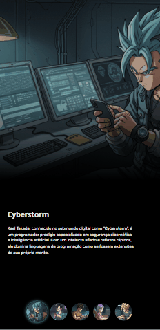

# Projeto Dragon Ball! 🐉

Um projeto de site baseado no Dragon Ball Z, porém são personagens que foram concebidos como arquétipos de programadores com habilidades excepcionais no ciberespaço, cada um com características únicas. Contendo a imagem, o nome do personagem e sua descrição. Ao lado direito possue os botões clicáveis que ficam destacados, com cor em volta e mostram o personagem selecionado para telas maiores. Para telas menores, os botões ficam na parte de baixo. Para telas de desktops, tablets e celulares 📲💻🖥

## Tecnologias utilizadas
- HTML
- CSS
- JAVASCRIPT

## 📂 Acesso ao projeto

Você pode acessar o código fonte do projeto 

<https://github.com/denisero19/dragon-ball>